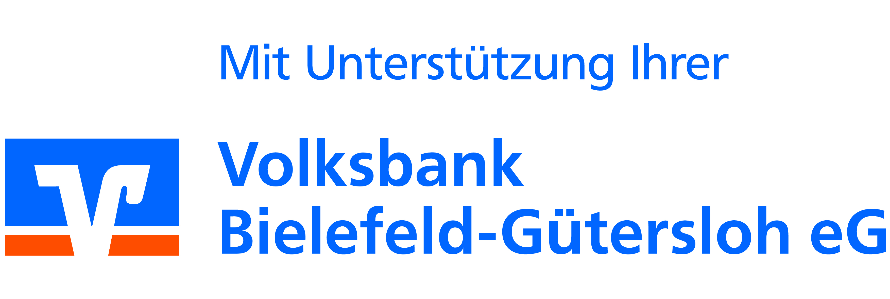

Sehr geehrter Herr Prange,

vielen Dank für Ihre Anfrage über unsere Homepage vom 06.10.2020.

Gerne unterstützen wir Sie bei Ihrem Engagement zur Förderung der Bildung mit einer Spende in Höhe von 500,00 Euro. Die Auszahlung der Spende erfolgt Anfang 2021.

Im Gegenzug freuen wir uns, wenn Sie unsere Unterstützung mit unserem Logo auf Ihrer Homepage veröffentlichen.

Hier unser Logo:

Vielen Dank.

Hinweis:  
Zur Verwirklichung von großen Projekten, bieten wir eine Crowdfunding-Plattform für gemeinnützige Projekte aus unserer Region an. 

Crowdfunding (Schwarm- oder Gruppenfinanzierung) ist ein innovatives Modell, bei dem eine Vielzahl von Menschen gemeinsam Projekte finanziert. Unter der Dachmarke „Viele schaffen mehr“ wollen wir so gemeinnützigen Vereinen und Organisationen die Möglichkeit geben, ihre Wunschideen zu veröffentlichen und so eine breite Öffentlichkeit für ihr Projekt zu gewinnen. Mit vielen kleinen Beiträgen wird so etwas Großes auf die Beine gestellt. Die Volksbank Bielefeld-Gütersloh wird jedes Vorhaben durch ein Co-Funding mit dem gleichen Betrag unterstützen.

Weitere Informationen finden Sie auf unserer Internetseite  
www.volksbank-bi-gt.viele-schaffen-mehr.de

Wir wünschen Ihnen alles Gute in dieser schwierigen Zeit.

Freundliche Grüße

Ihre  
Volksbank Bielefeld-Gütersloh eG